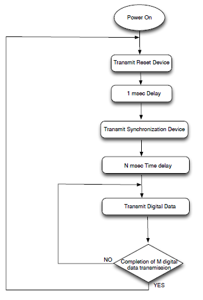
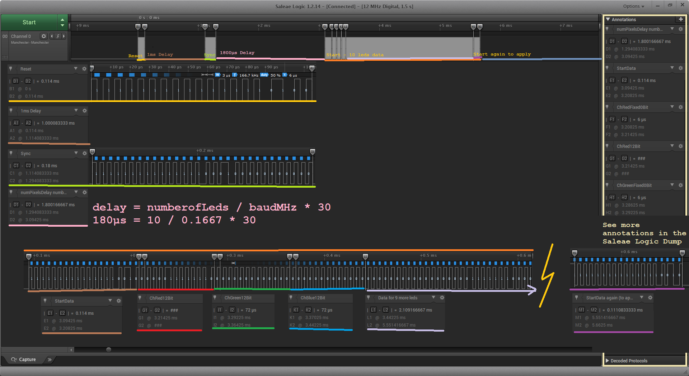

# TLS3001_LED_ESP32
A LED driver for the adressable LED driver TLS3001 for esp-idf (ESP32).

## About this LED driver
This LED driver uses the ESP-IDF RMT driver to produce the quirky wave format used by TLS3001 LED driver.

## esp-idf RMT driver
RMT is normaly used for sending and receiving infrared protocols which are pulse width modulated.
You can build build up an array of a start- and a end-time to make pretty nice time sensitive stuff and lett the RMT driver read your array.

https://docs.espressif.com/projects/esp-idf/en/latest/api-reference/peripherals/rmt.html

## LED Protocol
* The LED driver TLS3001 uses a Manchester coded format where a falling edge represents a logical One, and a raising edge represents a zero.

* The speed of the protocol can be between 100kHz and 1MHz.

* A sequence consists of the following sequences

1. Reset device (19 bits, 15 x 0b1, 1 x 0b0, 1 x 0b1 & 2 x 0b0).
2. Delay 1mS.
3. Synchronize device (30 bits, 15 x 0b1, 3 x 0b0, 1 x 0b1 & 11 x 0b0).
4. Delay (numberofLeds / baudrateInMHz * 30, is 1800µs for 10 LED's running at 166.7kHz).
5. Start of data (19 bits, 15 x 0b1, 2 x 0b0, 1 x 0b1 & 1 x 0b0).
6. Data for each pixel (39 bits, 1 x 0b0, 12bits pixel data, 1 x 0b0, 12bits pixel data, 1 x 0b0 & 12bits pixel data). Repeat data for each LED in string.
7. Start of data (19 bits, 15 x 0b1, 2 x 0b0, 1 x 0b1 & 1 x 0b0). For applying the data.
8. 0.125ms delay between end of last data and start or reset

Saleae Logig dump: https://github.com/TimGremalm/TLS3001_LED_ESP32/raw/master/protocol/TLS3001_Protocol_Dump_12MHz_18MSamples.logicdata

## CPU vs RAM
I have tried to built this driver for placing all the LED data in RAM and letting the RMT driver take care of the timing critical parts which let me plenty of CPU for Wifi-stuff.
This driver might need some optimization, it uses much RAM.

# How to use this driver

